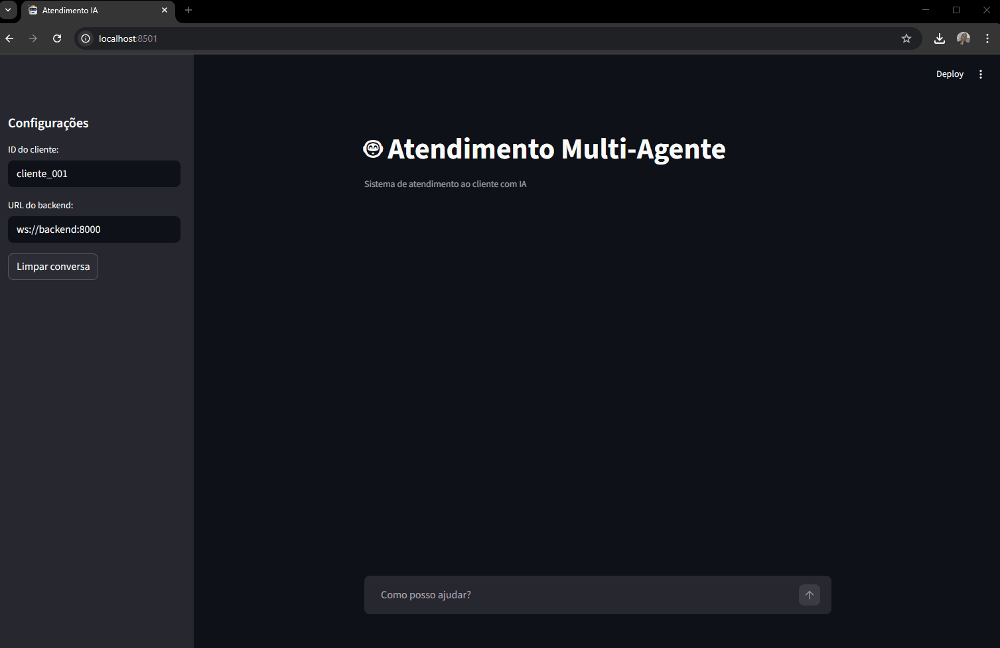

# Atendimento Multi-Agente com PydanticAI


> Sistema de atendimento ao cliente que usa múltiplos agentes de IA especializados para classificar intenções, consultar dados reais e responder com contexto — tudo em tempo real via WebSocket.

---

## Demo

```
┌─────────────────────────────────────────────────────┐
│  *Atendimento Multi-Agente*                         │
│                                                     │
│  Cliente: Não consigo acessar minha conta           │
│                                                     │
│  [Orquestrador detecta: intenção TÉCNICA]           │
│  [Delega para Agente Técnico]                       │
│  [Agente busca pedidos do cliente_001]              │
│                                                     │
│  IA: Entendo sua frustração! Verifiquei sua conta   │
│  e encontrei um pedido #P-4521 com status           │
│  "aguardando confirmação de email". Você verificou  │
│  sua caixa de entrada?                              │
│                                                     │
│  sentimento: frustrado | escalar: false             │
└─────────────────────────────────────────────────────┘
```

### 🤖 Agente Financeiro


### 🔧 Agente Técnico


### 💼 Agente de Vendas


---

## Arquitetura

```
┌──────────────┐   WebSocket    ┌───────────────────────────────────────┐
│   Streamlit  │◄──────────────►│              FastAPI Backend          │
│   Frontend   │                │                                       │
└──────────────┘                │  ┌─────────────────────────────────┐  │
                                │  │        Orquestrador             │  │
                                │  │  (classifica intenção e delega) │  │
                                │  └──────┬──────────┬───────────────┘  │
                                │         │          │          │       │
                                │    ┌────▼──┐  ┌───▼──┐  ┌───▼───┐     │
                                │    │Técnico│  │Finan.│  │Vendas │     │
                                │    └───┬───┘  └──┬───┘  └───┬───┘     │
                                │        │         │           │        │
                                │   ┌────▼─────────▼───────────▼────┐   │
                                │   │           Tools               │   │
                                │   │  pedidos | faturas | catálogo │   │
                                │   │           + RAG               │   │
                                │   └──────────────┬────────────────┘   │
                                └──────────────────┼────────────────────┘
                                                   │
                                    ┌──────────────▼──────────────┐
                                    │      PostgreSQL + pgvector  │
                                    │   tabelas + embeddings RAG  │
                                    └─────────────────────────────┘
                                    ┌─────────────────────────────┐
                                    │           Redis             │
                                    │     sessões + histórico     │
                                    └─────────────────────────────┘
```

### Fluxo de uma mensagem

```
1. Cliente digita mensagem no Streamlit
2. WebSocket envia {"texto": "Quero ver minha fatura"}
3. FastAPI valida o formato e verifica prompt injection
4. Orquestrador (GPT-4o-mini) classifica a intenção → "financeiro"
5. Orquestrador chama tool chamar_financeiro(pergunta)
6. Agente Financeiro consulta faturas do cliente no PostgreSQL
7. Agente formata resposta como RespostaAgente (schema Pydantic)
8. Histórico é persistido no Redis (últimas 20 trocas)
9. Resposta retorna via WebSocket como {"tipo": "final", ...}
10. Streamlit renderiza resposta + alerta se precisar escalar
```

---

## O problema que este projeto resolve

Sistemas de atendimento tradicionais têm dois problemas:

1. **Um único modelo para tudo**: um LLM genérico tenta responder perguntas
   financeiras, técnicas e de vendas — geralmente bem em nenhuma delas.

2. **Sem acesso a dados reais**: o modelo responde com informações genéricas
   e não consegue dizer "seu pedido #P-4521 está em trânsito".

Este projeto demonstra uma alternativa: **múltiplos agentes especializados**,
cada um com acesso às ferramentas e dados relevantes para seu domínio, coordenados
por um orquestrador que toma a decisão de roteamento.

---

## Stack Tecnológica

| Tecnologia | Papel | Por que esta escolha |
|-----------|-------|---------------------|
| **PydanticAI** | Framework de agentes | Schema-first: cada agente tem `output_type` Pydantic validado. Alternativas (LangChain, CrewAI) têm mais magic implícita |
| **FastAPI** | Backend + WebSocket | Async nativo, tipagem forte, WebSocket built-in via Starlette |
| **PostgreSQL + pgvector** | Dados + RAG | Um banco para dados relacionais E busca semântica. Evita manter Pinecone/Weaviate separado |
| **Redis** | Sessões + histórico | Estruturas de lista nativas (`RPUSH`, `LTRIM`) para histórico de conversa com TTL automático |
| **Streamlit** | Frontend | Prototipagem rápida de chat sem escrever React/Vue |
| **Logfire** | Observabilidade | Auto-instrumentação de SQLAlchemy, Redis, FastAPI e PydanticAI em uma linha por camada |
| **Docker Compose** | Orquestração local | Ambiente reproduzível com db, redis, backend, frontend em um comando |

---

## Funcionalidades

- [x] Roteamento automático de intenção por orquestrador LLM
- [x] 3 agentes especializados: Técnico, Financeiro, Vendas
- [x] Consulta de pedidos com filtro por tenant (cliente_id)
- [x] Consulta de faturas com filtro por tenant
- [x] Busca de produtos por termo e preço máximo
- [x] **RAG em todos os 3 agentes** — base de conhecimento com busca semântica via pgvector
- [x] **Anti-alucinação** — threshold de distância cosseno filtra resultados irrelevantes; agente escala para humano quando não tem informação no banco
- [x] **Streaming progressivo** (typewriter effect) — resposta chega palavra a palavra
- [x] **Histórico de conversa como contexto** — agentes consideram as últimas 3 trocas
- [x] Histórico de sessão persistido no Redis (últimas 20 trocas, TTL renovável)
- [x] Detecção de sentimento do cliente
- [x] Flag `precisa_escalar_humano` para casos complexos (e para perguntas fora da base de conhecimento)
- [x] Guardrail contra prompt injection
- [x] Validação de input com Pydantic (max 2000 chars, formato obrigatório)
- [x] Observabilidade com Logfire (auto-instrumentação: SQL, Redis, HTTP — sem ruído de modelos internos)
- [x] Health check profundo (verifica DB e Redis, não só "estou vivo")
- [x] Seed script com dados realistas (3 clientes, 8+ pedidos, 10 produtos, 10 artigos RAG)

---

## Como rodar localmente

### Pré-requisitos

- Docker + Docker Compose
- Uma chave de API da OpenAI

### 1. Clone e configure

```bash
git clone https://github.com/gleissonbispo/pydanticai-mult-agentes.git
cd pydanticai-mult-agentes

# Cria o arquivo .env a partir do exemplo
cp .env.example .env
```

Edite o `.env` e adicione sua chave OpenAI:

```env
OPENAI_API_KEY=sk-sua-chave-aqui
```

### 2. Suba os serviços

```bash
docker-compose up --build
```

Na primeira execução, isso vai:
1. Baixar as imagens (PostgreSQL com pgvector, Redis, Python)
2. Instalar dependências Python
3. Criar as tabelas no PostgreSQL via `init_db.sql`
4. Criar o schema de banco pelo `create_all` (safety net)

### 3. Acesse

| Serviço | URL |
|---------|-----|
| Frontend (Streamlit) | http://localhost:8501 |
| Backend (FastAPI) | http://localhost:8000 |
| API Docs (Swagger) | http://localhost:8000/docs |
| Health check | http://localhost:8000/health |

### 4. Popule o banco com dados de teste

```bash
docker-compose exec backend python scripts/seed_data.py
```

Isso insere 3 clientes de teste com pedidos, faturas e produtos variados, além de 10 artigos de conhecimento para o RAG. Se `OPENAI_API_KEY` estiver configurada, os artigos recebem embeddings reais e a busca semântica (com threshold de relevância) funcionará.

> **Importante**: sem `OPENAI_API_KEY`, os artigos são inseridos sem embedding e o RAG retornará sempre "SEM_RESULTADO" — os agentes vão escalar para humano corretamente em vez de alucinar.

Clientes disponíveis após o seed:
- `cliente_001` — 3 pedidos (entregue, enviado, pendente) + 1 fatura atrasada
- `cliente_002` — 3 pedidos + 2 faturas
- `cliente_003` — 2 pedidos + 1 fatura próxima do vencimento

### Troubleshooting comum

**`relation "pedidos" does not exist`**
O banco subiu antes do `init_db.sql` ser executado. Execute:
```bash
docker-compose down -v  # remove o volume do banco
docker-compose up --build
```

**`Connection refused` no frontend**
O backend ainda está inicializando. Aguarde o healthcheck do Docker:
```bash
docker-compose ps  # verifique se backend está "healthy"
```

**`OPENAI_API_KEY not configured`**
Verifique se o `.env` está na raiz do projeto (não dentro de `backend/`).

**Frontend não conecta ao backend**
Confirme que `BACKEND_URL` no `.env` está como `ws://backend:8000` para Docker
ou `ws://localhost:8000` para dev local sem Docker.

---

## Estrutura do Projeto

```
pydanticai-mult-agentes/
│
├── .env.example              # template de variáveis de ambiente
├── docker-compose.yml        # orquestra todos os serviços
│
├── backend/
│   ├── Dockerfile
│   ├── pyproject.toml        # dependências Python
│   └── app/
│       ├── main.py           # FastAPI app + lifespan (CORS, DB, Redis)
│       ├── config.py         # Settings com Pydantic (lê .env)
│       │
│       ├── agents/           # Agentes PydanticAI
│       │   ├── __init__.py   # AgentDeps (dependências injetadas)
│       │   ├── orchestrator.py  # classifica intenção e delega
│       │   ├── tecnico.py    # suporte técnico + RAG
│       │   ├── financeiro.py # faturas e cobranças
│       │   └── vendas.py     # produtos e recomendações
│       │
│       ├── models/
│       │   ├── db.py         # modelos SQLAlchemy (ORM)
│       │   └── schemas.py    # schemas Pydantic (input/output)
│       │
│       ├── routes/
│       │   └── chat.py       # endpoint WebSocket /api/ws/chat/{cliente_id}
│       │
│       ├── services/
│       │   ├── database.py   # engine SQLAlchemy + context manager
│       │   └── session.py    # SessionService (Redis)
│       │
│       ├── tools/            # funções de acesso ao banco (usadas pelos agentes)
│       │   ├── pedidos.py
│       │   ├── faturas.py
│       │   └── catalogo.py
│       │
│       ├── rag/
│       │   ├── embeddings.py # gera embeddings com text-embedding-3-small
│       │   └── retriever.py  # busca cosine similarity no pgvector
│       │
│       ├── guardrails/
│       │   └── __init__.py   # detecta prompt injection, valida cliente_id
│       │
│       ├── observability/
│       │   └── logfire_setup.py  # auto-instrumentação Logfire
│       │
│       └── tests/
│           ├── conftest.py   # fixtures (deps mockados)
│           └── test_agentes.py
│
├── frontend/
│   ├── Dockerfile
│   ├── requirements.txt
│   └── streamlit_app.py      # UI de chat com WebSocket
│
└── scripts/
    ├── init_db.sql            # cria extensões e tabelas no PostgreSQL
    └── seed_data.py           # popula banco com dados de teste
```

---

## Decisões Técnicas e Trade-offs

### Por que PydanticAI?

Neste momento o PydanticAI é o objeto de estudo!

### Por que pgvector e não Pinecone/Weaviate?

**Operacional**: menos serviços para gerenciar. O PostgreSQL já era necessário
para dados relacionais — adicionar a extensão `vector` mantém tudo no mesmo
banco, backup, transações, e SQL familiar.

**Custo**: pgvector é gratuito e self-hosted. Pinecone tem custo por vetor/query
que pode crescer rapidamente.

Trade-off: para escala muito grande (bilhões de vetores), pgvector tem limitações
de performance que vetorbancos dedicados resolvem melhor.

### Por que Redis para sessões e não PostgreSQL?

O histórico de conversa é lido/escrito a cada mensagem — é dado de alta
frequência e curta duração (TTL de 1 hora). Redis tem latência de sub-milissegundo
para operações de lista (`RPUSH`, `LRANGE`) e TTL nativo. Guardar isso no
PostgreSQL seria desperdiçar sua força (queries complexas, ACID) em um caso
de uso onde não precisamos disso.

### Por que WebSocket e não HTTP polling?

O streaming de resposta (tokens chegando progressivamente enquanto o LLM gera)
requer uma conexão bidirecional persistente. HTTP polling introduziria latência
visível no efeito de "digitação" da IA. WebSocket é o padrão correto para
esse caso de uso.

### O padrão Orquestrador + Especialistas

Cada agente especialista tem um system prompt focado em seu domínio e acesso
apenas às tools relevantes. Isso oferece:

1. **Prompts mais curtos e eficazes**: o agente técnico não precisa saber
   nada sobre faturas
2. **Segurança por compartimentação**: o agente de vendas não tem acesso
   a dados financeiros
3. **Manutenção independente**: você pode melhorar o agente financeiro sem
   tocar nos outros

Trade-off: duas chamadas ao LLM por mensagem (orquestrador + especialista)
aumenta latência e custo. Para casos simples, um único agente seria mais
eficiente.

---

*Projeto construído para portfólio e aprendizado pessoal em sistemas de IA com Python.*
